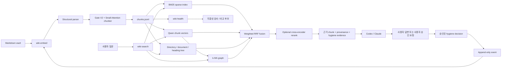
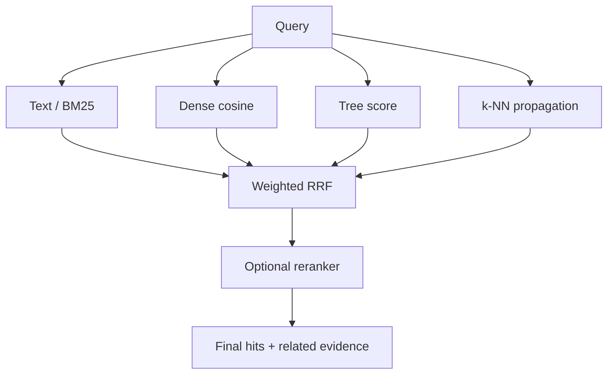

# LLM-Wiki V3 아키텍처와 동작 원리

이 문서는 LLM-Wiki V3를 처음 보는 사람도 시스템이 무엇을 하는지 이해하고,
개발자는 실제 코드와 데이터 계약을 따라가며 구현을 검증할 수 있도록 작성되었다.

문서의 기준은 현재 공개 구현인 `0.1.0`과 `llm-wiki-v3` 브랜치다. 아이디어나
향후 계획이 아니라 **현재 코드가 실제로 수행하는 동작**을 설명한다.

### 목적에 따라 읽는 방법

- 전체 개념을 빠르게 보려면 1~5장과 20장을 읽는다.
- Chunker를 이해하려면 6~8장을 읽는다.
- 검색 결과가 만들어지는 원리를 보려면 9~10장을 읽는다.
- 모순, 정정, supersede 정책을 보려면 11~12장을 읽는다.
- 구현을 수정하거나 review하려면 13~19장까지 확인한다.

## 1. 한 문장으로 설명하면

LLM-Wiki V3는 Markdown 문서를 의미 단위의 chunk로 나누고, 각 chunk를 여러
방식으로 색인한 뒤, Codex나 Claude가 질문에 답할 때 근거와 출처를 함께 찾을
수 있게 해 주는 로컬 지식 검색 시스템이다.

여기서 중요한 점은 다음과 같다.

- LLM-Wiki가 최종 답의 진실 여부를 스스로 판정하지 않는다.
- 원본 Markdown이 지식의 원본이고 `.llm_wiki_v3/`는 다시 만들 수 있는 파생물이다.
- 일반 검색, 벡터 검색, 문서 구조, 이웃 관계를 함께 사용한다.
- 모순이나 오류 후보는 프로그램이 증거만 준비한다.
- 최종 판단은 사용자가 사용하는 Codex/Claude와 사용자에게 남긴다.

비유하면 LLM-Wiki V3는 도서관의 사서이자 색인 시스템이다. 책을 정리하고,
질문과 관련된 페이지를 찾아 주고, 서로 충돌할 수 있는 기록을 나란히 보여
준다. 하지만 어느 기록이 사실인지 최종 판결하는 역할은 맡지 않는다.

## 2. 시스템 전체 그림



시스템은 크게 네 층으로 나뉜다.

1. **원본 층**: 사용자가 관리하는 Markdown 문서
2. **색인 층**: chunk, vector, BM25, Tree, k-NN graph
3. **검색 층**: 네 채널 검색, RRF 결합, 선택적 reranking
4. **판단 층**: Codex/Claude와 사용자 승인에 의한 문서 위생 처리

## 3. 핵심 용어

| 용어 | 뜻 |
|---|---|
| Vault | 검색 대상으로 지정한 Markdown 디렉터리 |
| Document | 하나의 `.md` 파일 |
| Structural block | heading, paragraph, table, code, HTML, list 등 Markdown 구조 단위 |
| Sentence gap | 두 문장 사이의 잠재적인 chunk 경계 |
| Candidate | Small Attention이 실제로 판단하도록 Gate가 선택한 sentence gap |
| Chunk | 검색과 출처 추적의 최소 저장 단위 |
| Embedding | 텍스트 의미를 수치 벡터로 표현한 값 |
| Tree | 디렉터리, 문서, heading 경로를 나타내는 결정론적 계층 |
| k-NN | 의미 벡터가 가까운 chunk를 연결한 이웃 그래프 |
| Provenance | chunk가 어느 원문 위치에서 왔는지 나타내는 출처 정보 |
| Hygiene event | supersede, dispute, correction을 기록하는 append-only 사건 |

## 4. 설계 원칙

### 4.1 Markdown이 source of truth다

사용자가 작성한 `.md` 파일이 지식의 원본이다. 다음 파일들은 모두
`.llm_wiki_v3/` 아래에 생성되는 파생 색인이다.

```text
.llm_wiki_v3/
├── manifest.json
├── chunks.jsonl
├── vectors.npy
├── tree.json
├── knn_graph.npz
├── knn_groups.json
├── sparse_index/
│   └── documents.json
├── sentence_embedding_cache/
└── hygiene/
    └── events.jsonl
```

파생 색인이 손상되면 삭제 후 `wiki-embed --full`로 다시 생성할 수 있다.
반대로 원본 Markdown을 잃으면 색인만으로 원문을 완전히 복원할 수 있다고
가정해서는 안 된다.

### 4.2 판단과 저장을 분리한다

Python 프로그램은 의미가 비슷한 문서나 충돌 가능성이 있는 chunk를 찾을 수
있다. 하지만 의미 유사성은 모순의 증거가 아니다. 같은 주제를 설명하는 두
문장이 서로 보완 관계일 수도 있기 때문이다.

따라서 LLM-Wiki V3는 다음 경계를 유지한다.

```text
프로그램: 후보 검색, 출처 검증, metadata 적용
Codex/Claude: 문맥 해석, 사용자에게 설명과 질문
사용자: 최종 승인 또는 정정 내용 제공
```

`wiki-health apply`는 `user_approved=true`가 없는 결정을 거부한다.

### 4.3 구조 경계가 의미 추정보다 우선한다

Heading, code, table, HTML, list 같은 Markdown 구조는 작성자가 명시한 정보다.
프로그램은 이 구조를 먼저 인식한다. Attention 모델은 일반 prose 문장만 입력으로
받는다.

### 4.4 원문 위치를 잃지 않는다

각 chunk는 `source_start`, `source_end`, `source_text`, `content_hash`를 가진다.

```python
source_text == markdown[source_start:source_end]
```

이 관계는 `wiki-health`가 검사한다. 검색용 `text`에서 Markdown soft wrap을
정리하더라도 정확한 원문은 `source_text`에 그대로 보존한다.

## 5. 명령어와 생명주기

| 명령 | 역할 | 입력 | 주요 출력 |
|---|---|---|---|
| `wiki-embed` | 문서를 chunking하고 전체 색인을 생성 | Markdown vault | `.llm_wiki_v3/` |
| `wiki-search` | 네 검색 채널을 결합해 근거를 반환 | 자연어 질문 | ranked chunks |
| `wiki-health` | 색인 무결성과 hygiene 상태를 검사 | 색인, event | 오류/경고 |
| `wiki-eval` | 검색 조합을 gold query로 비교 | 평가 JSON | retrieval metrics |

일반적인 실행 순서는 다음과 같다.

```text
문서 작성/수정
    -> wiki-embed
    -> wiki-health
    -> wiki-search
    -> Codex/Claude가 근거를 읽고 답변
```

문서 오류나 모순을 검토할 때는 다음 순서를 따른다.

```text
wiki-health review
    -> Codex/Claude가 후보 비교
    -> 사용자 확인
    -> 승인 JSON 생성
    -> wiki-health apply
    -> 자동 rebuild
    -> wiki-health
```

## 6. 인덱싱 파이프라인

### 6.1 문서 발견과 증분 처리

`wiki-embed`는 vault 아래의 모든 `.md` 파일을 재귀적으로 찾는다. 다음
디렉터리는 색인 대상에서 제외한다.

```text
.git
.llm_wiki_v3
__pycache__
.pytest_cache
.venv
node_modules
```

각 문서의 SHA-256을 `manifest.json`에 기록한다. 다음 실행에서는 기존 manifest와
비교해 변경된 문서만 다시 chunking하고 embedding한다.

```text
동일한 hash      -> 기존 chunk와 vector 재사용
새로운/변경 hash -> 다시 chunking + embedding
삭제된 문서      -> 기존 chunk와 vector 제거
```

모델 ID, schema version, chunk/vector 행 수가 맞지 않으면 기존 색인을 호환되지
않는 것으로 보고 전체를 다시 계산한다. `--full`은 이 판단과 무관하게 전체를
재생성한다.

### 6.2 1단계: Markdown structural split

먼저 문서를 다음 구조 단위로 나눈다.

- YAML frontmatter
- `#`부터 `######`까지의 heading
- 일반 paragraph
- fenced code block
- Markdown table
- HTML block
- ordered/unordered list
- thematic break

Heading 자체는 검색 chunk가 되지 않는다. 대신 이후 prose chunk의
`heading_path`와 `chunk_heading` metadata가 된다.

```markdown
# Service

## Retry

The client retries temporary failures.
```

위 prose chunk는 다음 metadata를 가진다.

```json
{
  "heading_path": ["Service", "Retry"],
  "chunk_heading": "Retry"
}
```

모든 heading level은 현재 구현에서 hard structural boundary다. Heading을 넘어
Attention 문맥을 만들거나 chunk를 merge하지 않는다.

Code와 table은 구조와 줄바꿈을 보존한다. 구현상 paragraph 바로 뒤의 code/table은
하나의 composite structural block이 될 수 있다. 이 경우 보호 영역만이 아니라
composite block 전체를 Small Attention 입력에서 제외한다. HTML과 list도 Small
Attention 입력에서 제외된다.

### 6.3 2단계: 문장 분리와 두 종류의 텍스트

일반 paragraph만 문장 단위로 분리한다. Markdown의 줄바꿈은 문장 종료 기호가
아니므로 soft-wrapped 문장은 하나의 문장으로 유지된다.

```markdown
The component descriptor is stored next to the
source code of the component.
```

이 문장은 embedding과 검색용 `text`에서는 한 줄처럼 정리되지만,
`source_text`에는 원래 줄바꿈이 남는다.

각 문장은 두 표현을 갖는다.

- `text`: 원문 위치를 나타내는 정확한 문자열
- `embedding_text`: 링크, 강조, inline code 등 일부 Markdown 표식을 정리한 문자열

Chunk의 최소 semantic 분리 단위는 문장이다. Attention 결과 때문에 문장 중간에서
chunk를 자르지 않는다.

### 6.4 3단계: 문장 embedding

모든 refinable prose 문장을 `Qwen/Qwen3-Embedding-0.6B`로 batch embedding한다.
기본 출력 차원은 checkpoint 계약상 1024다.

길이가 비슷한 문장을 같은 batch 근처에 배치해 padding 낭비를 줄인 뒤, 결과
벡터는 다시 원래 문서 순서로 복원한다. embedding은 정규화된 벡터로 반환된다.

문서 ID, 모델 ID, 전체 문장 텍스트를 SHA-256으로 묶어 `.npy` cache key를 만든다.
따라서 같은 문서는 sentence embedding을 재사용할 수 있지만, 문서 문장 하나가
바뀌면 현재 구현에서는 그 문서의 sentence cache 전체 key가 달라진다.

`device="auto"`는 PyTorch가 CUDA를 사용할 수 있으면 GPU를, 그렇지 않으면 CPU를
선택한다.

## 7. Semantic chunker의 원리

현재 production chunker 이름은 다음 조합을 뜻한다.

```text
Markdown structural split
    + contextual cosine Gate
    + local valley priority
    + Small-V3 Attention verifier
```

### 7.1 Prose stream

같은 heading 아래에서 structural block index가 연속된 일반 paragraph는 하나의
prose stream으로 연결한다. 따라서 빈 줄로 나뉜 두 paragraph 사이도 Attention
후보가 될 수 있다.

다음 요소가 사이에 있으면 stream이 끊긴다.

- heading 변경
- table
- code block
- HTML block
- list
- 그 밖의 non-prose structural block

### 7.2 Contextual cosine curve

문장 embedding을 `e_1, e_2, ..., e_n`이라고 하자. 문장 `i`와 `i+1` 사이 gap의
점수를 두 문장만 비교해서 만들지 않는다.

기본 `window_size=2`에서 다음처럼 좌우 문맥 평균을 만든다.

```text
L_i = mean(e_(i-1), e_i)
R_i = mean(e_(i+1), e_(i+2))
```

문서 시작과 끝에서는 존재하는 문장만 사용한다. Contextual cosine은 다음과 같다.

```text
sim(i) = dot(L_i, R_i) / (norm(L_i) * norm(R_i))
```

모든 gap의 `sim(i)`를 순서대로 놓으면 similarity curve가 된다. 구현은 prefix sum을
사용해 window 평균을 계산하므로 gap마다 문장 벡터를 다시 합산하지 않는다.

### 7.3 Local valley

주변보다 similarity가 낮은 지점은 주제가 바뀔 가능성이 높다.

```text
0.81  0.78  0.44  0.75  0.80
            ^ valley
```

현재 local valley 조건은 양쪽 값보다 엄격하게 낮은 plateau다. 같은 최저값이
연속되면 plateau의 가운데 gap 하나를 결정론적으로 선택한다. 문서 양 끝처럼
양쪽 이웃이 모두 없는 gap은 valley로 표시하지 않는다.

### 7.4 Candidate gate

모든 gap을 Small Attention에 보내면 계산량이 커진다. Gate는 먼저 가능성이 높은
gap만 고른다.

정렬 우선순위는 정확히 다음과 같다.

1. local valley인 gap
2. contextual cosine이 더 낮은 gap
3. block/gap 위치에 의한 안정적인 tie-break

후보 수는 다음과 같다.

```text
candidate_count = ceil(total_gap_count * candidate_budget)
```

gap이 하나 이상이면 최소 한 개를 선택한다. 기본 `candidate_budget=0.50`이므로
문서 내 prose gap의 약 50%가 Attention 검증 단계로 들어간다.

**현재 구현 주의:** 실험 과정에서 사용했던 별도의 TextTiling-style depth score는
production gate에 포함되어 있지 않다. 현재 candidate score는 local valley 우선순위와
contextual cosine 순위로 구성된다.

### 7.5 Small-V3 Attention verifier

각 candidate gap에 대해 왼쪽 최대 3문장과 오른쪽 최대 3문장을 가져온다.

```text
S(i-2), S(i-1), S(i), [BOUNDARY], S(i+1), S(i+2), S(i+3)
```

문장이 부족한 가장자리에는 zero vector와 invalid mask를 사용한다. 모델 구조는
다음과 같다.

| 항목 | 값 |
|---|---:|
| 입력 embedding 차원 | 1024 |
| 내부 model 차원 | 256 |
| Transformer encoder layer | 2 |
| Attention head | 4 |
| Feed-forward 차원 | 1024 |
| 문맥 문장 수 | 왼쪽 3 + 오른쪽 3 |
| 출력 | `P(boundary)` |

처리 과정은 다음과 같다.

```text
6 sentence embeddings
    -> Linear projection 1024 -> 256
    -> learned boundary token 삽입
    -> learned position embedding 추가
    -> 2-layer TransformerEncoder
    -> boundary token 위치 분류
    -> sigmoid
    -> P(boundary)
```

기본 판정 계약은 다음과 같다.

```text
P(boundary) >= 0.66 -> KEEP
P(boundary) <  0.66 -> MERGE
```

여기서 KEEP은 두 문장 사이를 chunk 경계로 유지한다는 뜻이고, MERGE는 같은 chunk로
묶는다는 뜻이다.

### 7.6 Candidate가 아닌 gap의 동작

이 부분은 구현을 이해할 때 중요하다.

- 한 paragraph 내부의 non-candidate gap은 분리하지 않는다.
- 서로 다른 빈 줄 paragraph 사이의 candidate가 MERGE이면 두 chunk를 합친다.
- 서로 다른 빈 줄 paragraph 사이의 candidate가 KEEP이면 경계를 유지한다.
- 서로 다른 paragraph 사이 gap이 candidate로 선택되지 않으면 structural 경계를
  그대로 유지한다.

즉 Gate는 paragraph 내부에서는 “분리 가능한 위치의 상한”으로 작동하고,
빈 줄 paragraph 사이에서는 “기존 구조 경계를 제거할 수 있는 위치”도 선택한다.

### 7.7 세분화 조절 변수

```toml
chunk_boundary_keep_threshold = 0.66
chunk_candidate_budget = 0.50
```

- `chunk_boundary_keep_threshold`를 낮추면 더 많은 candidate가 KEEP이 되어 chunk가
  대체로 세분화된다.
- `chunk_candidate_budget`을 높이면 Attention이 더 많은 gap을 검토한다. 계산량이
  증가하며, paragraph 내부에서 분리 가능한 위치도 늘어난다.
- `gate_window_size=2`와 `attention_context_window=3`은 checkpoint 학습 계약에
  고정되어 있어 일반 설정으로 변경할 수 없다.

Threshold 조절 효과는 문서 분포에 따라 달라지므로 감으로 정하지 말고
vault-specific `wiki-eval` 자료를 만들어 비교하는 것이 안전하다.

## 8. Chunk 데이터 계약

대표 chunk는 다음 형태다.

```json
{
  "id": "chunk:6bbab5a523caf8acd154",
  "document_id": "architecture/retry-policy",
  "source_path": "architecture/retry-policy.md",
  "ordinal": 3,
  "kind": "paragraph",
  "text": "The client retries transient failures.",
  "source_text": "The client retries\ntransient failures.",
  "source_start": 412,
  "source_end": 451,
  "heading_path": ["Client", "Retry"],
  "chunk_heading": "Retry",
  "previous_chunk_id": "chunk:previous",
  "next_chunk_id": "chunk:next",
  "document_created_at": "2026-01-03T09:00:00+09:00",
  "document_modified_at": "2026-08-26T12:00:00+09:00",
  "sentence_count": 1,
  "semantic_refined": true,
  "content_hash": "sha256..."
}
```

Chunk ID는 문서 ID, source span, content hash를 조합한 값의 SHA-1 앞 20자리로
만든다. 원문이나 위치가 바뀌면 ID가 바뀔 수 있다. 따라서 외부 시스템은 chunk
ID를 영구적인 문서 ID로 간주하지 않아야 한다.

문서 timestamp는 frontmatter의 다음 필드를 우선 사용한다.

```text
created / created_at / date
modified / modified_at / updated / updated_at
```

값이 없으면 filesystem creation/change time과 modified time을 사용한다. 운영체제마다
`st_ctime` 의미가 다를 수 있으므로 장기적으로 신뢰할 timestamp가 필요하면
frontmatter에 명시하는 편이 좋다.

## 9. 색인 구조

### 9.1 Dense vectors

Chunk embedding 입력에는 본문만 사용하지 않고 문서와 heading 문맥도 붙인다.

```text
Document: architecture/retry-policy
Heading: Client > Retry
The client retries transient failures.
```

정규화된 chunk vector는 `vectors.npy`에 `chunks.jsonl`과 같은 행 순서로 저장한다.
따라서 두 파일의 행 수와 정렬은 하나의 계약이다.

### 9.2 Sparse BM25 index

BM25용 텍스트는 document ID, heading path, 본문으로 구성한다. Tokenizer는 영문
소문자/숫자/underscore와 한글 문자열을 인식한다. 한글 문자열에는 인접 2글자
token도 추가해 띄어쓰기 변화에 어느 정도 대응한다.

현재 tokenizer는 한 문서 내 중복 token을 제거한다. 따라서 field 반복에 의한
term-frequency boost보다 “해당 token이 존재하는가”에 더 가까운 sparse 신호가 된다.

### 9.3 Deterministic Tree

Tree는 LLM이 생성하지 않는다. 경로와 heading metadata로 항상 같은 결과가 나오는
계층을 만든다.

```text
root
└── directory: architecture
    └── document: architecture/retry-policy
        └── heading: Client
            └── heading: Retry
```

각 node에는 자신 아래에 속한 모든 `chunk_ids`가 들어간다. 중첩 directory의 각
중간 폴더마다 별도 node를 만드는 것이 아니라, 현재는 document가 속한 전체
directory path를 하나의 directory node path로 기록한다. Node ID는 tree path의
SHA-1 기반 안정 ID다.

이 방식의 장점은 빠르고 재현 가능하며 LLM 호출 비용이 없다는 것이다. 단점은
디렉터리와 heading이 부정확하면 Tree 품질도 그 한계를 그대로 가진다는 것이다.

### 9.4 k-NN graph와 group

모든 정규화 chunk vector 사이의 내적을 계산하고 각 chunk에서 가장 가까운 K개를
고른다. 기본값은 `k=3`이다.

```text
similarity(i, j) = vector_i dot vector_j
```

방향성 이웃을 저장한 뒤 grouping을 위해 edge를 양방향으로 간주하고 connected
component를 만든다. 각 group의 centroid를 계산한 뒤 centroid에 가장 가까운 chunk
최대 5개를 representative로 저장한다.

현재 구현은 전체 `N x N` similarity matrix를 메모리에 만든다.

- 시간 복잡도: 대략 `O(N^2 * d)`
- similarity matrix 메모리: `O(N^2)`

따라서 매우 큰 vault에서는 ANN index로 교체해야 한다. 또한 mutual edge threshold
없이 connected component를 만들기 때문에 문서 분포에 따라 큰 group 하나가 생길
수 있다. 검색은 group label보다 저장된 이웃 edge를 직접 활용한다.

## 10. 검색 아키텍처

`wiki-search`는 같은 질문을 네 채널에서 독립적으로 순위화한 뒤 결과를 합친다.



검색 전에 `searchable=true`, `status != retracted`, `--range` 조건을 적용한다. 즉
검색 제외 대상을 먼저 제거한 뒤 모든 채널이 같은 admissible set을 사용한다.

### 10.1 Text channel

질문 token과 sparse index를 BM25Okapi로 비교한다. Text 점수가 0보다 큰 결과만
해당 채널 ranking에 포함한다.

이 채널은 정확한 용어, 파일명, 함수명, 고유명사를 찾는 데 유리하다.

### 10.2 Dense channel

질문 앞에 retrieval instruction을 붙여 Qwen으로 query embedding을 만든다.

```text
Instruct: Given a search query, retrieve relevant knowledge-base chunks
Query: <사용자 질문>
```

Chunk와 query vector가 정규화되어 있으므로 다음 내적은 cosine similarity와 같다.

```text
dense(i) = chunk_vector_i dot query_vector
```

표현이 달라도 의미가 비슷한 문서를 찾는 핵심 채널이다.

### 10.3 Tree channel

각 Tree node에 대해 node 아래 chunk의 최고 dense 점수와 query/node token Jaccard를
결합한다.

```text
lexical(node) = |query_tokens intersection node_tokens|
                / |query_tokens union node_tokens|

tree(node) = 0.65 * max_descendant_dense + 0.35 * lexical(node)
```

계산된 node 점수는 해당 node 아래 chunk에 전달된다. 너무 넓은 directory가 모든
자식에게 같은 점수를 주는 문제를 줄이기 위해 directory 이름과 query의 lexical
교집합이 없으면 그 directory node는 건너뛴다.

### 10.4 k-NN channel

Dense 상위 최대 10개 chunk를 seed로 선택하고, seed의 저장된 이웃에게 점수를
전파한다.

```text
seed_score = dense(seed) / seed_rank

neighbor_score = dense(seed)
                 * max(edge_similarity, 0)
                 / seed_rank
```

질문과 직접적으로 가장 가까운 chunk뿐 아니라 그 chunk와 의미적으로 연결된
설명, 예시, 후속 내용을 함께 발견하는 것이 목적이다.

### 10.5 Weighted Reciprocal Rank Fusion

채널마다 점수 척도가 다르므로 raw score를 바로 더하지 않는다. 각 채널의 순위를
Weighted RRF로 결합한다.

```text
RRF(document) = sum_channel(
    channel_weight / (rrf_k + rank_channel(document))
)
```

기본값은 다음과 같다.

| 채널 | weight |
|---|---:|
| Text | 1.0 |
| Dense | 2.0 |
| Tree | 0.8 |
| k-NN | 0.8 |
| `rrf_k` | 60 |

Dense를 중심으로 사용하되 정확한 단어와 문서 구조, 의미 이웃을 보조 증거로
활용하는 설정이다.

### 10.6 Optional reranker

`--rerank N`을 사용하면 RRF 상위 N개 query/chunk raw text pair를
`BAAI/bge-reranker-v2-m3` Cross-Encoder로 다시 평가한다. Reranker는 query와 chunk를
동시에 읽으므로 embedding 내적보다 정밀하지만 느리다.

Reranker 로딩이나 inference가 실패하면 기본 검색 결과를 유지하고
`reranked=false`를 반환한다. 검색 자체를 실패시키지 않는 graceful fallback이다.

### 10.7 `--auto`의 의미

`--auto`는 답변을 생성하지 않는다. 검색 결과가 바로 답변에 사용될 만큼 분명한지
`answer`, `review`, `none` 중 하나로 분류한다. 내부적으로 rerank pool 10을 요청한다.

판정 순서는 다음과 같다.

```text
검색 결과 없음                      -> none
top dense < 0.30                    -> none
reranker 사용 불가                  -> review
supersede/dispute evidence 존재      -> review
top dense < 0.55                    -> review
top dense - second dense < 0.04     -> review
그 외                               -> answer
```

이는 검색 confidence heuristic이지 답의 사실성을 증명하는 장치가 아니다.

### 10.8 `--range N`

최근 N년 문서만 admissible set에 넣는다. 시간 우선순위는 다음과 같다.

1. partial supersede claim의 최신 `decided_at`
2. `document_modified_at`
3. `document_created_at`

Timestamp가 없는 chunk는 range 검색에서 제외된다.

## 11. 문서 위생과 신뢰성 모델

### 11.1 Review는 판정이 아니다

`wiki-health review`는 k-NN edge 중 cosine이 기본 `0.72` 이상인 pair를 비교
후보로 반환한다.

```json
{
  "type": "semantic_comparison_candidate",
  "is_contradiction": null,
  "cosine_similarity": 0.82,
  "left": { "...": "chunk A" },
  "right": { "...": "chunk B" }
}
```

`is_contradiction`이 `null`인 이유는 프로그램이 모순을 판정하지 않기 때문이다.
Codex/Claude는 범위, 버전, 시점, 전제, 정확한 claim을 비교한 뒤 사용자에게
질문해야 한다.

### 11.2 Append-only event overlay

Hygiene 변경은 기존 `chunks.jsonl`을 수동 편집하는 방식이 아니다.
`hygiene/events.jsonl`에 event를 append하고, chunk를 읽을 때 event를 순서대로
적용해 현재 metadata view를 만든다.

```text
base chunks + ordered events -> current chunk state
```

이 구조는 어떤 판단이 언제 추가되었는지 추적할 수 있게 한다.

### 11.3 Partial supersede

Chunk 전체가 아니라 특정 문장이나 claim 일부만 오래된 경우 사용한다.

- 기존 chunk는 `searchable=true`로 남는다.
- `superseded_claims`에 quote, source offset, 결정 시각, 이유를 기록한다.
- 새 chunk에는 `supersedes` 역관계를 기록한다.
- 기존 chunk가 검색되면 successor를 `SUPERSEDED_BY` evidence로 함께 반환한다.

따라서 오래된 한 문장 때문에 같은 chunk의 나머지 유효한 내용을 숨기지 않는다.

### 11.4 Error correction

사용자가 기존 정보가 잘못되었다고 확정한 경우 사용한다.

- 원본 Markdown을 덮어쓰지 않는다.
- `_wiki_corrections/` 아래에 새로운 Markdown 문서를 만든다.
- 기존 chunk를 `status=retracted`, `searchable=false`로 만든다.
- 새 correction chunk를 기존 chunk의 replacement로 연결한다.
- 결정 시각과 오류 quote를 metadata에 기록한다.

Correction 문서를 만든 직후 rebuild가 수행되어야 새 chunk ID가 event 관계에
연결된다.

### 11.5 Dispute

어느 쪽이 맞는지 확정하지 못했을 때 사용한다.

- 관련 chunk를 모두 `status=disputed`로 표시한다.
- 둘 다 검색 가능 상태로 유지한다.
- 검색 결과에는 상대 chunk를 `DISPUTED_WITH` evidence로 함께 붙인다.

사용자에게 불확실성을 숨기지 않는 것이 목적이다.

### 11.6 승인과 낙관적 동시성

Decision은 `user_approved=true`를 요구한다. `expected_content_hash`가 제공되면 검토
시점 이후 기존 chunk 내용이 바뀌지 않았는지도 검사한다. 공식 skill contract는
안전한 적용을 위해 이 hash를 항상 포함하도록 요구한다.

내용이 바뀌었다면 오래된 판단을 적용하지 않고 새 evidence로 다시 검토해야 한다.

## 12. `wiki-health`가 실제로 검사하는 것

`wiki-health`는 문서의 사실 여부가 아니라 시스템 무결성을 검사한다.

- 필수 index 파일 존재 여부
- `chunks.jsonl`과 `vectors.npy` 행 수 일치
- manifest chunk 수 일치
- 현재 Markdown hash와 manifest 일치
- source span이 실제 원문과 일치
- source text SHA-256 일치
- Tree의 dangling/missing chunk ID
- sparse index와 chunk 순서 일치
- k-NN matrix shape와 index 범위
- hygiene event가 존재하는 chunk를 참조하는지
- correction/resolution Markdown이 실제로 존재하는지
- correction/resolution이 rebuild되어 새 chunk와 연결되었는지

따라서 `OK: healthy`는 “색인과 출처 관계가 일관적이다”라는 뜻이지 “모든 문장이
사실이다”라는 뜻이 아니다.

## 13. `wiki-eval`의 원리

평가는 사용자가 만든 gold JSON을 기준으로 retrieval channel 조합을 비교한다.

```json
[
  {
    "query": "How are authentication failures handled?",
    "relevant_document_ids": ["architecture/retry-policy"],
    "relevant_chunk_ids": [],
    "range_years": null
  }
]
```

기본 비교 variant는 다음과 같다.

| Variant | 채널 |
|---|---|
| `text_dense` | Text + Dense |
| `text_dense_tree` | Text + Dense + Tree |
| `text_dense_knn` | Text + Dense + k-NN |
| `full` | 네 채널 모두 |
| `full_rerank` | Full + reranker, 요청 시 |

Query embedding은 variant마다 반복하지 않고 한 번 계산해 cache한다. 각 variant에
대해 다음 metric을 계산한다.

- `Hit@K`: K개 안에 관련 결과가 하나라도 있는 비율
- `MRR`: 첫 관련 결과 순위의 역수 평균
- `Recall@K`: gold relevance 중 K개 안에서 찾은 비율
- `nDCG@K`: 관련 결과가 상위에 배치된 정도
- 총 retrieval 시간과 query당 평균 latency

같은 relevant document에서 여러 chunk가 반환되어도 document relevance는 한 번만
센다. Threshold나 weight를 test query 결과에 맞춰 조정하면 평가 누수가 발생하므로
별도의 validation set을 두어야 한다.

## 14. 설정값 읽는 법

| 설정 | 기본값 | 역할 |
|---|---:|---|
| `model_id` | Qwen3-Embedding-0.6B | 문장/chunk/query embedding 모델 |
| `embed_device` | `auto` | CUDA 또는 CPU 선택 |
| `embedding_batch_size` | 32 | embedding batch 크기 |
| `chunk_boundary_keep_threshold` | 0.66 | Attention KEEP 기준 |
| `chunk_candidate_budget` | 0.50 | Attention으로 보낼 gap 비율 |
| `knn_k` | 3 | chunk당 의미 이웃 수 |
| `candidate_pool` | 50 | 채널별 RRF 후보 pool 하한 |
| `rrf_k` | 60 | RRF 순위 완화 상수 |
| `text_weight` | 1.0 | Text 채널 가중치 |
| `dense_weight` | 2.0 | Dense 채널 가중치 |
| `tree_weight` | 0.8 | Tree 채널 가중치 |
| `knn_weight` | 0.8 | k-NN 채널 가중치 |
| `auto_answer_cosine` | 0.55 | auto answer 최소 dense 점수 |
| `auto_none_cosine` | 0.30 | auto none 상한 |
| `auto_margin` | 0.04 | top-2 분리 기준 |
| `review_similarity` | 0.72 | health review pair 최소 cosine |

가중치와 threshold는 모델의 보편적 진리가 아니라 현재 operating point다. 공개
기본값을 바꿀 때는 gold evaluation 결과와 함께 변경해야 한다.

## 15. 성능 특성

### 초기 실행

가장 큰 비용은 Qwen model 로딩과 전체 문서 embedding이다. GPU가 있으면 자동으로
사용한다. 길이별 batch 정렬로 padding 비용을 줄인다.

### 증분 실행

문서 hash가 같은 chunk/vector는 재사용한다. 변경된 문서만 다시 계산하므로 일반적인
운영에서는 전체 rebuild보다 빠르다.

### 검색

Query embedding이 가장 큰 고정 비용이다. BM25, Tree, k-NN propagation, RRF는
상대적으로 가볍다. Reranker는 후보 pair를 직접 읽기 때문에 후보 수에 비례해
추가 비용이 발생한다.

### 현재 확장성 한계

- k-NN build가 exact `N x N` 방식이다.
- BM25 객체를 search process 시작 시 메모리에서 구성한다.
- vector와 chunk 전체를 단일 배열/JSONL로 로딩한다.
- multi-process writer locking이나 transactional index swap은 없다.

대형 조직용 vault로 확장하려면 ANN, persistent sparse index, sharding, atomic build
directory 같은 후속 설계가 필요하다.

## 16. 신뢰 경계와 실패 모드

| 상황 | 현재 동작 |
|---|---|
| Qwen 모델 없음 | 첫 사용 시 다운로드 필요 |
| CUDA 없음 | CPU fallback |
| Reranker 실패 | RRF 결과 유지, `reranked=false` |
| 원문 수정 후 미색인 | `wiki-health`가 `index-stale` 보고 |
| source span 손상 | health error |
| correction 생성 후 미색인 | `correction-not-embedded` |
| 오래된 승인 JSON | content hash가 있으면 거부 |
| 사실과 다른 원문 | 자동 판정하지 않음, 사용자 검토 필요 |
| Tree heading 품질 저하 | 구조 검색 품질도 함께 저하 |
| 매우 큰 chunk 수 | exact k-NN의 시간/메모리 급증 |

## 17. 코드 지도

| 파일 | 책임 |
|---|---|
| [`config.py`](../src/llm_wiki_v3/config.py) | `wiki.toml` 탐색, 검증, runtime 설정 |
| [`indexing.py`](../src/llm_wiki_v3/indexing.py) | 증분 build, Tree/k-NN/sparse artifact 생성 |
| [`search.py`](../src/llm_wiki_v3/search.py) | 네 채널 검색, RRF, range, auto, rerank |
| [`embedder.py`](../src/llm_wiki_v3/embedder.py) | Qwen query/chunk embedding, optional reranker |
| [`hygiene.py`](../src/llm_wiki_v3/hygiene.py) | append-only event와 metadata overlay |
| [`health.py`](../src/llm_wiki_v3/health.py) | artifact/provenance 검사와 review/apply CLI |
| [`evaluate.py`](../src/llm_wiki_v3/evaluate.py) | gold validation, retrieval ablation metrics |
| [`text.py`](../src/llm_wiki_v3/text.py) | sparse tokenization과 embedding input 조립 |
| [`pathing.py`](../src/llm_wiki_v3/pathing.py) | Windows 8.3 path를 포함한 vault-relative 경로 처리 |
| [`models.py`](../src/llm_wiki_v3/models.py) | 검색 결과와 health issue 계약 |
| [`chunking/structural.py`](../src/llm_wiki_v3/chunking/structural.py) | Markdown block와 sentence source span |
| [`chunking/semantic.py`](../src/llm_wiki_v3/chunking/semantic.py) | contextual cosine, local valley, boundary context |
| [`chunking/runtime.py`](../src/llm_wiki_v3/chunking/runtime.py) | Qwen runtime와 Small Attention model |
| [`chunking/chunker.py`](../src/llm_wiki_v3/chunking/chunker.py) | 구조/semantic 결합과 최종 chunk 생성 |

## 18. 반드시 유지해야 하는 불변식

개발자가 기능을 추가할 때 다음 조건을 깨면 안 된다.

1. `source_text == original[source_start:source_end]`
2. `chunks.jsonl`의 행 순서와 `vectors.npy`의 행 순서가 같다.
3. Heading을 넘어 semantic merge하지 않는다.
4. Code/table/HTML/list를 Small Attention 문장 입력으로 사용하지 않는다.
5. Chunk를 문장 중간에서 semantic split하지 않는다.
6. Partial supersede는 기존 chunk 전체를 검색 제외하지 않는다.
7. Error correction은 기존 chunk를 검색 제외하고 replacement를 연결한다.
8. Dispute는 어느 한쪽을 임의로 삭제하지 않는다.
9. 사용자 승인 없는 hygiene decision을 적용하지 않는다.
10. `wiki-health`의 success를 사실 검증 완료로 해석하지 않는다.

## 19. 현재 구현과 후속 확장을 구분하기

현재 구현에 존재하는 것:

- Markdown structural split
- window=2 contextual cosine
- local valley 우선 candidate ranking
- Small-V3 Attention
- deterministic directory/document/heading Tree
- exact k-NN graph
- BM25 + Dense + Tree + k-NN weighted RRF
- optional local Cross-Encoder reranking
- append-only hygiene events

현재 구현에 아직 없는 것:

- 별도 TextTiling depth score를 사용하는 production gate
- LLM이 자동으로 주제명과 flexible Tree를 생성하는 기능
- ANN 기반 대규모 vector index
- 자동 모순/사실 판정
- 사용자의 승인 없이 문서를 자동 교정하는 기능
- RAG 답변 품질 자체를 판정하는 end-to-end LLM judge

이 구분은 중요하다. 문서화되지 않은 기능이 있다고 가정하면 benchmark 결과와
운영 동작을 잘못 해석할 수 있다.

## 20. 실제 질문 한 번이 처리되는 과정

사용자가 다음과 같이 묻는다고 하자.

```text
인증 실패도 자동으로 재시도해?
```

1. `wiki-search`가 질문을 Qwen query vector로 변환한다.
2. BM25가 `인증`, `실패`, `재시도`와 겹치는 chunk를 찾는다.
3. Dense channel이 표현은 다르지만 의미가 가까운 retry policy를 찾는다.
4. Tree channel이 `Client > Retry` heading 아래 chunk에 구조 점수를 준다.
5. k-NN이 retry policy의 설명/관측성 이웃을 보완 후보로 올린다.
6. RRF가 네 순위를 하나로 합친다.
7. 요청했다면 Cross-Encoder가 상위 후보를 다시 정렬한다.
8. 관련 chunk가 superseded/disputed 상태면 successor/counterpart도 함께 반환한다.
9. Codex/Claude가 `source_path`, heading, timestamp, 관련 evidence를 읽는다.
10. 근거가 명확하면 답하고, 충돌하면 사용자에게 불확실성을 설명한다.

이 과정에서 검색 프로그램은 답변 문장을 생성하지 않는다. 프로그램의 결과는
LLM이 읽을 수 있는 **근거 묶음**이다.

## 21. 개발자가 확장할 때 권장 순서

1. 바꾸려는 층이 chunking, indexing, retrieval, hygiene 중 어디인지 정한다.
2. 기존 artifact/data contract를 먼저 확인한다.
3. 동작을 재현하는 unit test를 추가한다.
4. source span과 row alignment 불변식을 검사한다.
5. `wiki-eval` validation 자료로 품질을 비교한다.
6. Linux/Windows, Python 3.11/3.13 CI를 모두 통과시킨다.
7. benchmark 없이 기본 threshold나 weight를 바꾸지 않는다.

특히 새로운 chunker checkpoint를 사용할 때는 embedding 차원, context window,
candidate policy, decision threshold가 학습 당시 계약과 같은지 검증해야 한다.

---

이 문서의 목적은 LLM-Wiki V3를 마법처럼 보이게 만드는 것이 아니라, 각 결과가
어떤 입력과 규칙에서 나왔는지 추적 가능하게 만드는 것이다. 시스템의 신뢰성은
하나의 모델 점수보다 구조 보존, 출처 연결, 사용자 승인, 재현 가능한 평가가 함께
유지될 때 생긴다.
